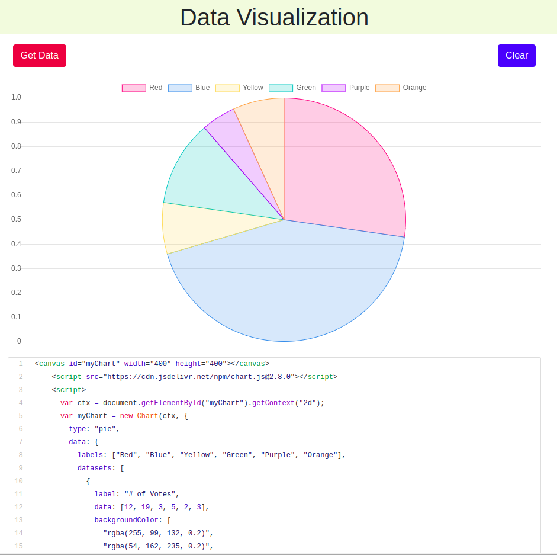

# Data Visualization

I am building a data visualization website which takes user data in the form of **CSV,json or javascript object** and provides useful **insights** about the data.

I have used **NodeJS** as the backend runtime environment to get the data from a _mongoDB database_ currently locally hosted. With the help of charting libraries **like D3.js** and **chart.js** I have tried to visualize the data.

In order to run the project on a NodeJS runtime,run:

```
npm install
```

It will install all the necessary dependencies. Then run:

```
npm run start
```

The server will get started on [localhost:3000](http://localhost:3000)



Follow me on LinkedIn: [Monzur Rahman](https://www.linkedin.com/in/monzur-rahman-baba02190/)

<a href="https://www.linkedin.com/in/monzur-rahman-baba02190/"></a>
